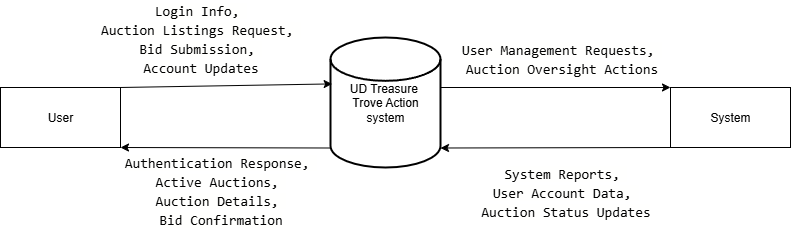
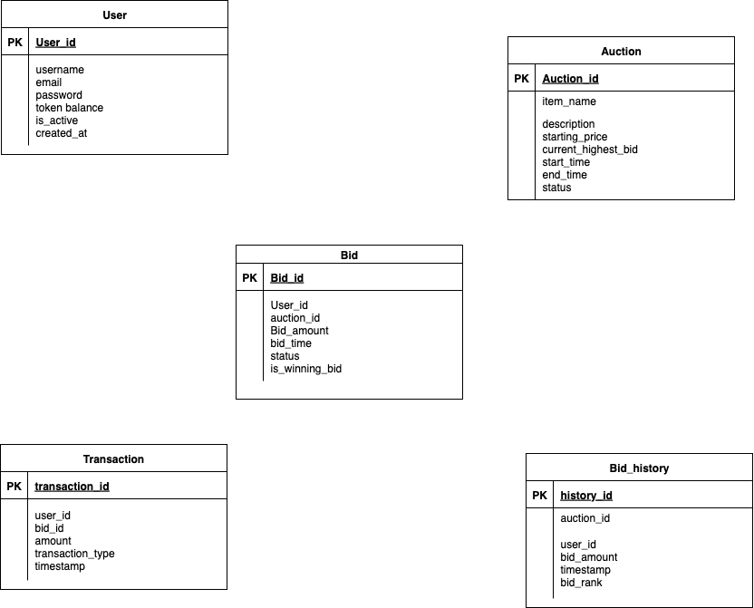
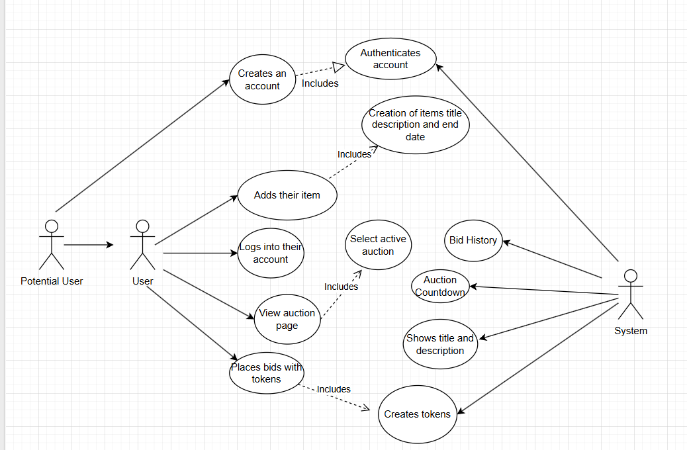

# UD Treasure Trove
  
**Anthony Boykin** 

**Nathan Hetman**

**Brock Hensley**
 

---
## Table of Contents
- [Introduction](#Introduction)

- [Sprint0](#Sprint-0)

- [Sprint1](#Sprint-1)

## Introduction

### Purpose  
This document outlines the system analysis for an online auction platform called UD Treasure Trove. The system allows users to create accounts, log in, list items for auction, browse and select active auctions, and place bids in real-time. The goal is to provide a secure, interactive platform for users to participate in auctions efficiently.

### Scope  
This document covers the system requirements, context diagrams, use case definitions, data dictionary, and process specification for the UD Treasure Trove auction system. It focuses on the following core features:

- User authentication and account management
- Adding auction items
- Viewing active auctions
- Selecting an auction to view details
- Placing bids

### Definitions & Acronyms  
**DFD: Data Flow Diagram**  
A data flow diagram (DFD) is a graphical representation that visually depicts how data moves through a system or process, illustrating the flow of information from its source to its destination, including where it is stored and how it is transformed along the way, using standardized symbols to represent different elements like processes, data stores, and external entities.  

**ERD: Entity Relationship Diagram**  
An entity relationship diagram (ERD) is a visual representation that shows how different entities (people, objects, or concepts) relate to each other within a system.  

**Use Case Diagram**  
A use case diagram is a visual representation of how users (called "actors") interact with a system, highlighting the different functionalities and goals they can achieve within that system.  

**Data Dictionary**  
A data dictionary is a collection of detailed information about the data elements in a system, including names, types, sources, relationships, and usage rules. It serves as a reference for understanding and maintaining the data structure.  

**Process Specification**  
A process specification defines the logic, rules, and data flows involved in a specific process within a system. It provides a detailed description of how inputs are transformed into outputs.  

### References  
- UD Treasure Trove Project Requirements
- IEEE Software Engineering Standards for Requirements Documentation 

### Overview  
This document provides:  
- An overview of the environment that this system must operate within, including other software and hardware systems that will interface with this system.  
- An overview of the features to be provided by the software.  
- A description of the types of users that will interact with this software and assumed properties of those users.  
- Any constraints that have been placed on the project (that are not, in themselves, requirements).  
- Any assumptions that are being made in specifying these requirements.  

---

**CPS 490 - Phase 0 - System Overview & Use Cases**  

---

## Sprint-0

### Product Perspective  
The system will operate as a web-based auction platform and interface with a backend database to store user accounts, auction items, bids, and bid histories. It will provide real-time updates for auctions and bids, ensuring all users see the latest bid information.

### Product Functions  
- User registration and authentication
- Add auction item with title, description, and end time
- View all active auctions
- Select an auction to view details and bid history
- Place bids using tokens or virtual currency
- Display real-time countdown timers and bid updates

### User Characteristics  
- **Users**: Primary actors who can create accounts, list items, browse auctions, and place bids.   
- **System**: Automatically manages auction timing, bid validation, and real-time updates. Manage user accounts, oversee auctions, and ensure system integrity.

### Constraints  
- Web-based with mobile compatibility
- Real-time bid updates must be supported
- Auctions cannot accept bids after the end time  

### Assumptions  
- Users have basic computer proficiency and access to the internet
- The database reliably stores user and auction information
- System clock is synchronized for accurate countdown timers

---

## Systems Analysis

### Context Level Data Flow Diagram  
The context-level DFD represents the auction system as a single process interacting with external entities:  
- **Users** – browse auctions, place bids, and manage their accounts
- **System** – oversee the auction system and manage user accounts  

  

---

### Entity-Relationship Diagram  
The Entity-Relationship Diagram models the auction system, capturing essential entities and their interactions. The primary entities include:  
- **User**  
- **Auction**  
- **Bid** 
- **Transaction**  
- **Bid_history**  

User interact with multiple processes through associative entities such as:  
- **User** – can create many Auctions and can place many Bids.
- **Auction** – can receive many Bids.  
- **Bid** – generates one or more Transactions. 
- **Bid_history** – can tracks all bids over time, linked to both User and Auction.

  

---

### Use Case Diagram  
The following actors and processes are represented in the use case diagram:  

- **User** – registers, logs in, adds auction items, creates items title, items description, creates items end date for auction, views auctions, selects active auctions, places bids  
- **System** – authenticates accounts, creates bid history, creates auction countdown, shows items title and description, creates tokens

  

Detailed use case scenarios for each actor and process can be found in the [Use Case Scenarios](case.md) file.

---

## Sprint-1 

###  User Guide

#### Create an Account
1. Click **Create Account**.  
2. Enter your personalized **username** and **password**.  
3. Click **Sign Up** — you’ll be redirected to the **Login page**.

#### Log In
1. Enter your **username** and **password**.  
2. Click **Log In**.  
3. Successful login redirects you to the **Posts page**.

#### Visit Posts Page
- After logging in, you can view the **Posts page**, which is **restricted** to logged-in users only.

#### Log Out
- On the Posts page, click **Log Out** to end your session.  
- You’ll be signed out and access to restricted pages is removed.

#### Update Your Account
1. Ensure you’re **logged in**.  
2. Click **Update Account**.  
3. Change your **username**, **password**, or both.  
4. Click **Update Account** again to confirm changes.

---

## Program Flow

### 1 Create an Account / Password Stored Securely
**Frontend:**  
User enters a username and password in the Signup page.  
`signup()` in `api/user.js` sends a  
`POST /api/v1/user/signup` request with `{ username, password }`.  

**Backend:**  
`routes/users.js` receives the request and calls `createUser()` in `services/users.js`.  
Inside that function, the password is **hashed with bcrypt** (`bcrypt.hash(password,10)`) and saved in MongoDB using the `User` model.

---

### 2 User Login
**Frontend:**  
User submits credentials through the Login page.  
`login()` in `api/user.js` sends  
`POST /api/v1/user/login` with `{ username, password }`.  
If successful, backend returns a **JWT token** which is stored in `AuthContext`.

**Backend:**  
`routes/users.js` calls `loginUser()` in `services/users.js`.  
`loginUser()` finds the user, verifies the password using `bcrypt.compare`, and returns a **signed JWT** (`jwt.sign({ sub: user._id })`).

---

### 3 Logout
**Frontend:**  
When user logs out, the token is removed from `AuthContext` (`setToken(null)`), ending the session.  

**Backend:**  
No backend change needed — JWT authentication is stateless.

---

### 4 Accessing a Restricted Page
**Frontend:**  
After login, protected requests (e.g., Update Account) include  
`Authorization: Bearer <token>` in the header.

**Backend:**  
`requireAuth` in `middleware/jwt.js` verifies the token.  
If valid, `req.auth.sub` identifies the logged-in user; if invalid, a 401 Unauthorized is returned.

---

### 5 Unauthorized Access
If no token is present:  
- **Frontend:** User cannot log in or see restricted pages.  
- **Backend:** `requireAuth` rejects the request with **401 Unauthorized**.

---

### 6 Updating User Account
**Frontend:**  
User clicks **Update Account**, enters new info, and submits.  
`updateUser()` in `api/user.js` sends a `PUT /api/v1/user/:id` request with `Authorization: Bearer <token>`.

**Backend:**  
`routes/users.js` verifies the token via `requireAuth`.  
If the logged-in user’s ID matches the URL ID, the password (if changed) is re-hashed using `bcrypt` and the record is updated in MongoDB.

---

### User Interface Design

---
Our main goal for our UI design is to make it familar to other apps that you use when you sign in and make it simple.

## Why/How
Why we did it this way is that we dont want to overwelhm the user when they're on our site. With having too much things to see and click on it can make it less easy for what their main reason was to do on our site.

How we did this was taking a lot of inspiration from the ebays login ui and just added all the account features within the top of the site.

---

